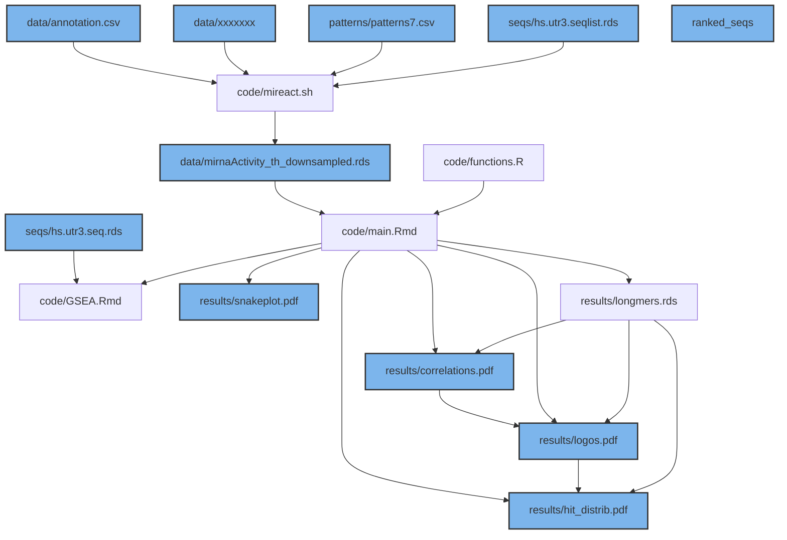

```mermaid
graph TD;
    seqlist[seqs/hs.utr3.seqlist.rds]
    seqs[seqs/hs.utr3.seq.rds]
    mireact_input[data/xxxxxxx]
    miReact_output[data/mirnaActivity_th_downsampled.rds]
    7mers[patterns/patterns7.csv]
    annotation[data/annotation.csv]
    miReact[code/mireact.sh]
    functions[code/functions.R]
    main_notebook[code/main.Rmd]
    GSEA[code/GSEA.Rmd]
    logos[results/logos.pdf]
    corrm[results/correlations.pdf]
    distrib[results/hit_distrib.pdf]
    snakeplot[results/snakeplot.pdf]
    longmers[results/longmers.rds]
    

    style seqlist fill:#7cb5ec,stroke:#333,stroke-width:2px;
    style miReact_output fill:#7cb5ec,stroke:#333,stroke-width:2px;
    style 7mers fill:#7cb5ec,stroke:#333,stroke-width:2px;
    style mireact_input fill:#7cb5ec,stroke:#333,stroke-width:2px;
    style seqs fill:#7cb5ec,stroke:#333,stroke-width:2px;
    style annotation fill:#7cb5ec,stroke:#333,stroke-width:2px;
    style logos fill:#7cb5ec,stroke:#333,stroke-width:2px;
    style corrm fill:#7cb5ec,stroke:#333,stroke-width:2px;
    style distrib fill:#7cb5ec,stroke:#333,stroke-width:2px;
    style ranked_seqs fill:#7cb5ec,stroke:#333,stroke-width:2px;
    style snakeplot fill:#7cb5ec,stroke:#333,stroke-width:2px;

    seqlist-->miReact
    7mers-->miReact
    mireact_input-->miReact
    annotation-->miReact
    miReact-->miReact_output
    functions-->main_notebook
    main_notebook-->longmers
    longmers-->logos
    longmers-->corrm
    longmers-->distrib
    main_notebook-->logos
    main_notebook-->corrm
    corrm-->logos
    logos-->distrib
    main_notebook-->distrib
    main_notebook-->GSEA
    seqs-->GSEA
    main_notebook--> snakeplot
    miReact_output-->main_notebook

```
